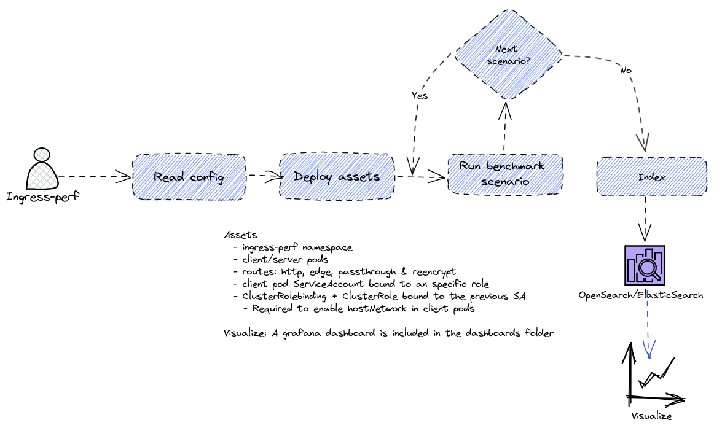

# ingress-perf - OCP Ingress Performance

[](https://github.com/cloud-bulldozer/ingress-perf/actions/workflows/release.yml)

OCP Ingress performance ultimate tool!



## Reference

Ingress-perf configuration is defined in a YAML file, holding an array of the following structure. [Examples directory](./examples)

| Field Name       | Type             | Description                                                                                 | Default Value | Tools |
|------------------|------------------|---------------------------------------------------------------------------------------------|---------------|------------------|
| `termination`    | `string`         | Benchmark termination. Allowed values are `http`, `edge`, `passthrough` and `reencrypt`.    | N/A           | `wrk`,`hloader` |
| `connections`    | `int`            | Number of connections per client.                                                           | `0`           | `wrk`,`hloader` |
| `samples`        | `int`            | Number of samples per scenario.                                                             | `0`           | `wrk`,`hloader` |
| `duration`       | `time.Duration`  | Duration of each sample.                                                                    | `""`          | `wrk`,`hloader` |
| `path`           | `string`         | Scenario endpoint path, for example: `/1024.html`, `/2048.html`.                            | `""`          | `wrk`,`hloader` |
| `concurrency`    | `int32`          | Number of clients that will concurrently run the benchmark scenario.                        | `0`           | `wrk`,`hloader` |
| `tool`           | `string`         | Tool to run the benchmark scenario.                                                         | `""`          | `wrk`,`hloader` |
| `serverReplicas` | `int32`          | Number of server (nginx) replicas backed by the routes.                                     | `0`           | `wrk`,`hloader` |
| `tuningPatch`    | `string`         | Defines a JSON merge tuning patch for the default `IngressController` object.               | `""`          | `wrk`,`hloader` |
| `delay`          | `time.Duration`  | Delay between samples.                                                                      | `0s`          | `wrk`,`hloader` |
| `warmup`         | `bool`           | Enables warmup: indexing will be disabled in this scenario.                                 | `false`       | `wrk`,`hloader` |
| `requestTimeout` | `time.Duration`  | Request timeout                                                                             | `1s`          | `wrk`,`hloader` |
| `procs`          | `int`            | Number of processes to trigger in each of the client pods                                   | `1`           | `wrk`,`hloader` |
| `keepalive`      | `bool`           | Use HTTP keepalived connections                                                             | `true`        | `hloader`       |
| `requestRate`    | `int`            | Number of requests per second                                                               | `0` (unlimited) | `hloader`     |
| `http2`          | `bool`           | Use HTTP2 requests, when possible                                                           | `false`         | `hloader`     |

## Supported tools

- wrk: HTTP benchmarking tool. https://github.com/wg/wrk. amd64 and arm64
- hloader: https://github.com/rsevilla87/hloader. amd64, arm64, ppc64le and s390x

## Running

Running ingress-perf is trivial:

```console
$ ./bin/ingress-perf -h
Benchmark OCP ingress stack

Usage:
   [command]

Available Commands:
  completion  Generate the autocompletion script for the specified shell
  help        Help about any command
  run         Run benchmark
  help        Print the version

Flags:
  -h, --help   help for this command

Use " [command] --help" for more information about a command.
```

Use the `run` subcommand to trigger a new benchmark. For example:

```console
$ ./bin/ingress-perf run --cfg cfg.yaml --es-server=https://elasticsearch-instance.com
time="2023-05-10 13:24:37" level=info msg="Running ingress performance 7eba7c57-d875-4b99-a490-be1752b62782" file="ingress-perf.go:39"
time="2023-05-10 13:24:37" level=info msg="Creating elastic indexer" file="ingress-perf.go:44"
time="2023-05-10 13:24:39" level=info msg="Starting ingress-perf" file="runner.go:36"
time="2023-05-10 13:24:40" level=info msg="Deploying benchmark assets" file="runner.go:112"
time="2023-05-10 13:24:41" level=info msg="Running test 1/9: http" file="runner.go:62"
```

Check out the `run` subcommand help for more info about the allowed flags.

## Service Mesh

Ingress-perf is compatible with the OpenShift implementation of the Istio ingress-gateway, provided by OpenShift Service Mesh. To enable it it's necessary to pass the flag `--service-mesh=true`, when specified, `ingress-perf` will create its routes in the namespace specified by `--gw-ns`, by deault `istio-system`, these routes point to the http2 port of the `istio-ingress-gateway` service. 4 gateways and 1 virtualservice are also created in the `ingress-perf` namespace.

At the time of writing these lines only the `http` and `edge` terminations are supported.

## Compile

Go 1.19 is required

```console
$ make build
GOARCH=`go env GOARCH` CGO_ENABLED=0 go build -v -ldflags "-X github.com/cloud-bulldozer/go-commons/version.GitCommit=34d5810c80185f788c67c41ea9e904bc22a98908 -X github.com/cloud-bulldozer/go-commons/version.Version=ingress-gateway -X github.com/cloud-bulldozer/go-commons/version.BuildDate=2024-02-01-10:23:15" -o bin/ingress-perf cmd/ingress-perf.go
$ ls bin/ingress-perf
ingress-perf
```
